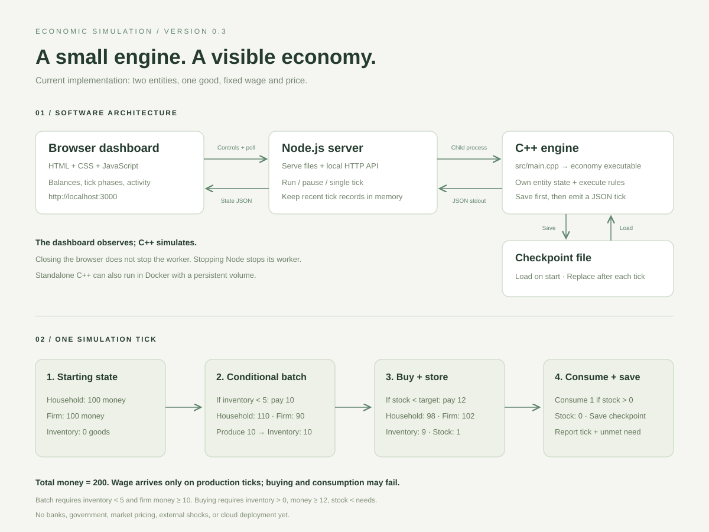

# Economic Simulation — first version

A tiny C++ engine with no third-party libraries, plus a live local dashboard. One household works for one
firm. Each tick, the firm produces 10 goods and pays a wage of 10 only when inventory
is below 5 and it can afford the wage. The household buys one good for 12 when
its stock is below `needs` (target stock, initially 2), then consumes one stored
good if available. If stock is empty, consumption is zero and an unmet need is
reported. Both entities start with 100 money units.
Money is transferred, so the total stays at 200. Prices and wages are fixed;
this is a starting mechanism, not a realistic economic forecast.



## Local dashboard

Build the engine as below, then install Node.js 18 or newer and run:

```sh
npm start
```

Open http://localhost:3000. No `npm install` is needed: the server uses only
Node's built-in modules. The dashboard starts paused. Use **Single tick** to
inspect one exchange, or **Run simulation** to run continuously. Pause before
changing the interval. Closing the browser does not stop the simulation;
stopping the Node server stops its C++ worker.

The dashboard owns `build/dashboard.state`, resumes it on restart, and displays
real C++ tick records (including the intermediate balances after wages).
It retains the last 200 ticks in memory and displays the last 20. Session
production/purchase/consumption/unmet-need counters and the activity log reset when Node restarts; the tick counter and
entity state persist. Bindings are local only, with no login or public endpoint.
Do not point another engine process at the dashboard's checkpoint.

Read [the detailed code walkthrough](docs/code-walkthrough.md) for the C++ logic,
dashboard plumbing, and deployment files. The [LinkedIn announcement draft](docs/linkedin-post.md)
is ready to adapt and share.

## Run locally

With CMake and a C++17 compiler:

```sh
cmake -S . -B build
cmake --build build
./build/economy --ticks 10 --interval-ms 0
```

On Windows the executable is `build/economy.exe` (or
`build/Debug/economy.exe` with Visual Studio). Without CMake, use GCC:

```sh
g++ -std=c++17 -O2 -Wall -Wextra -Wpedantic -pthread src/main.cpp -o build/economy
```

Create `build` first when compiling directly.
With Windows MinGW, omit `-pthread` and use `-o build/economy.exe`.

For continuous execution with a checkpoint after every tick:

```sh
./build/economy --forever --interval-ms 1000 --state build/economy.state
```

Ctrl+C stops the engine. Restart with the same state path to resume.
`--ticks N` runs N additional ticks. Without `--state`, every run starts fresh.
The state file is versioned plain text. New saves use `economy-v2`:

```text
economy-v2 TICK HOUSEHOLD_MONEY FIRM_MONEY FIRM_INVENTORY HOUSEHOLD_STOCK HOUSEHOLD_NEEDS
```

Legacy `economy-v1` files still load, keeping their tick/balances/inventory and
initializing household stock to 0 and needs to 2. They upgrade on the next saved
tick. V1 never saved household stock, so stock from any experimental run with
that format cannot be recovered. Total money is derived from balances, not saved
as a redundant field. V2 continues to store the final, post-consumption stock;
no format change is needed for this behavior update. Wage, price, batch size, and
threshold are fixed C++ constants rather than serialized configuration. Checkpoints are replaced via a temporary file after each
tick. Invalid state or write errors stop execution. Checkpoints are not fsynced,
so abrupt machine or storage failure can lose recent progress. Use one process
per state file; concurrent writers are unsupported.

## Continuous cloud execution

On a cloud VM with Docker Compose installed, copy this project and run:

```sh
docker compose up -d --build
docker compose logs --tail 20
docker compose down
```

Compose restarts the worker after a process failure or VM reboot when Docker is
enabled at startup. The named volume retains progress across container recreation;
`docker compose down -v` deletes it. Logs are rotated. Keep exactly one replica.
The VM must remain running; this setup does not provision a cloud account or VM.
This Docker image runs the engine only. The local dashboard is not included in
the container and has not been deployed online.

## Check the implementation

After building the engine:

```sh
npm test
```

Integration checks run the real executable for 1,000 ticks, inspect intermediate
transfers, verify batch thresholds, affordable buying, safe consumption, and goods/money accounting,
validate v1 migration/v2 persistence and malformed state rejection, and exercise
the local HTTP controls. Temporary checkpoints are isolated from dashboard state.

## Extend incrementally

`Household` and `Firm` hold entity state; `Economy::step()` defines the tick's
ordered processes. Add one behavior at a time, checking cash and inventory after
each change. A useful next step is a configurable wage or price, followed by a
household decision about how much to buy (one per tick currently prevents building a buffer when consumption is also one). External events, multiple goods, markets, APIs, and a UI can
be expanded as the basic model grows.
